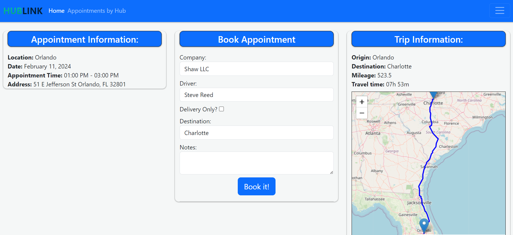
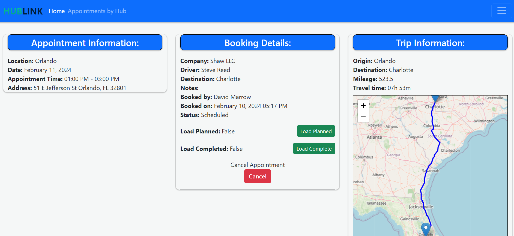
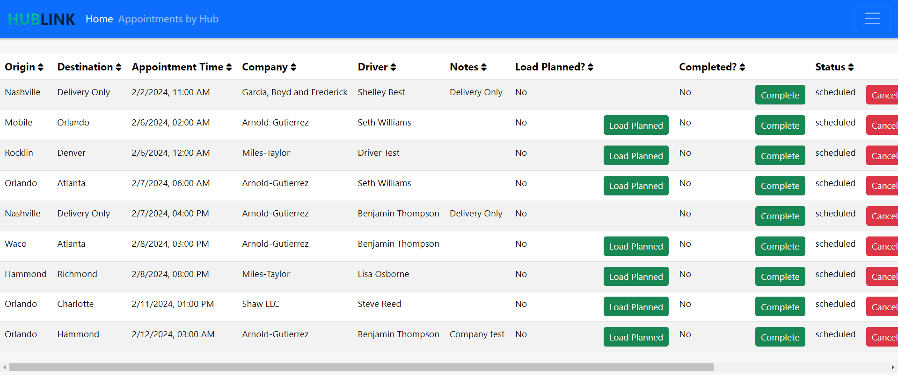

Hublink was written to address a use case I experienced during my time working in Logistics.

A Logistics hub and spoke network operates by having individual locations feed freight to distribution hubs (first mile). These hubs consolidate
the freight going to other regions and ship them to the hub in that area (long haul). When hubs receive these long haul shipments the freight is
distributed out to the individual locations (last mile).

These hub locations manage a heavy volume of inbound and outbound shipments, having a reliable, easy to use appointment system to manage the flow of these shipments is paramount to a smooth operating logistics network. 

Hublink enables appointment management for all phases of the hub network.

Note: All data for the examples below are fictional for application example purposes only.
A working example is available at [Hublink]
To seed the database with new appointment times click here [Hublink/seed]

Current user role implementation:
- **Planner** - Plans the shipments for the scheduled appointments.
- **Hub Manager** - Views the inbound an outbound appointments to manage staffing and daily operation.
- **Dispatcher** - Creates the appoitments for their individual companies and drivers.
- **Driver** - Manages their assigned appointments and daily schedule.

Calendar View:
Views are available for:
- Monthly
- Weekly
- Daily

On any calendar view users can select the location they wish to view then choose between available or booked appointments to populate the chosen calendar view.

To schedule an appointment or view a booked appointment details users click the desired date and time to retrieve the information.

Example:
User has selected an 1p appointment at the Orlando hub and is booking an appointment to go to the Charlote Hub. Hublink displays the trip information with GPS data specifically for Commerical Trucks. User is able to book the appointment.

Once an appointment is booked, it can be managed on an individual appointment basis or a table view displaying all appointments.
Note:
 - Driver role can only view their individual appointments.
 - Dispatcher role can only view their compainies appointments.
 - Hub Manager and Planner roles can view all appointments.

 Individual booked appointment detail:
 
 From the booking detail view a user can update the status of the shipment and the individual appointment.

 Table booked appointment view:
 
 This view provides users a holistic view of the booked appointments with the ability to  sort by any column and take the necessary actions for each booked appointment.

Technical Notes:
 - Backend: Please see requirements.txt for a full list.
    - PostgreSQL Database [Hublink Schema](https://dbdiagram.io/d/Copy-of-hublink-65c80560ac844320aee07e21)
    - Python
        - Frameworks used:
            - Flask
            - Flask Security
            - Flask WTForms
            - SQLAlchemy
 - Frontend:
    - HTML
    - CSS
        - Bootstrap
    - JavaScript
        - Frameworks used:
            - [FullCalendar](https://fullcalendar.io/)
            - [Leaflet](https://leafletjs.com/)

Map routing data powered by [Bing Maps Truck GPS API](https://www.microsoft.com/en-us/maps/bing-maps/truck-routing?)

 
